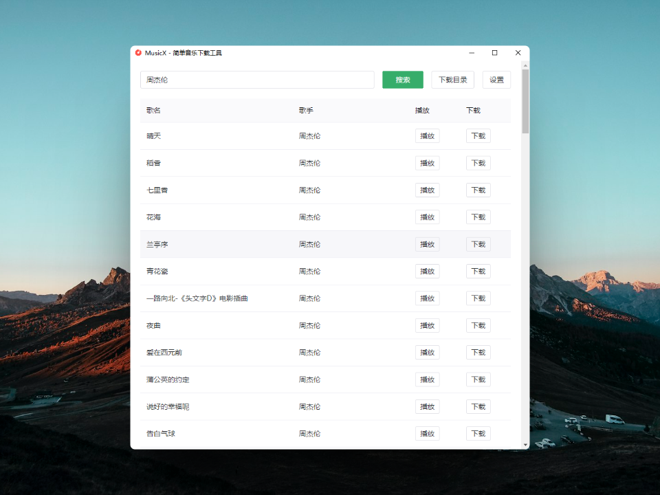

# MusicX - 跨平台简单音乐下载器

**使用Electron 开发的音乐下载工具。本项目属于个人实战项目，仅供学习，请勿商用。**

## 如何使用

从[release](https://github.com/danbaixi/musicx/releases)下载相对应平台程序文件，目前仅支持windows。

## 开发

**使用前请先安装NodeJS和npm**
```shell
git clone https://github.com/danbaixi/musicx.git
cd musicx
npm install
npm run dev
```

## 免责声明

本人不保证本项目中所有资源的合法性，下载资源后，用户需自行对下载资源进行合法性校验，若用户使用本项目下载的资源，本人不承担任何责任。